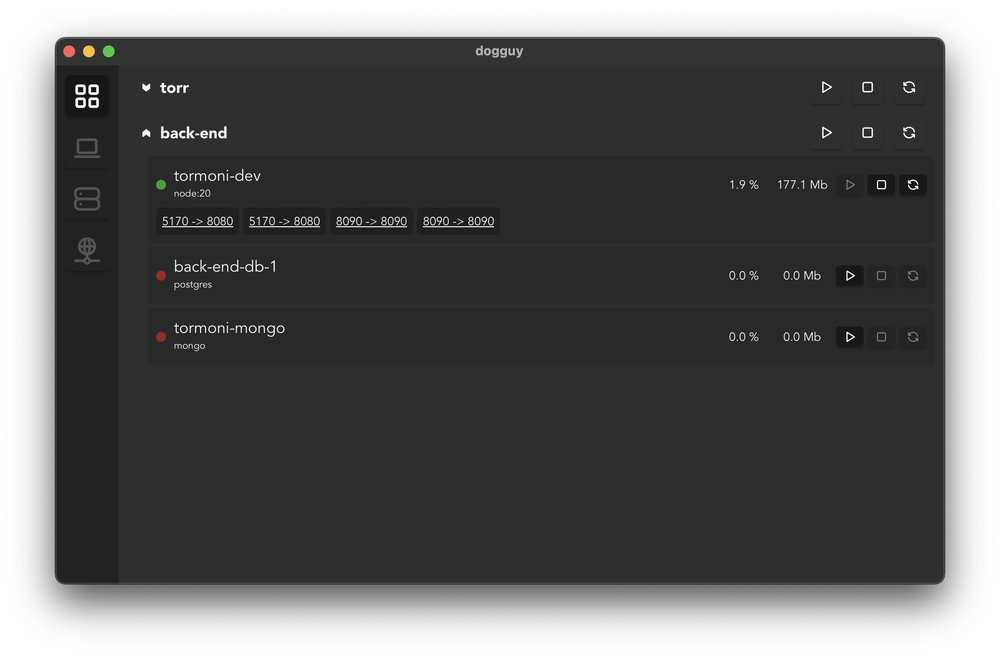

# docker-ui

A simple docker ui in early stage of development.

Uses Tauri + Svelte.

### Planned features
- Web-based access (portainer-like)
- Volume/Container file explorer
- Container terminal access
- Images manager
- Volumes manager
- Networks manager
- `colima` configuration integration
